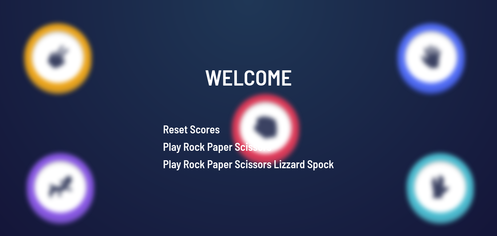

# Frontend Mentor - Rock, Paper, Scissors solution

This is a solution to the [Rock, Paper, Scissors challenge on Frontend Mentor](https://www.frontendmentor.io/challenges/rock-paper-scissors-game-pTgwgvgH). Frontend Mentor challenges help you improve your coding skills by building realistic projects.

## Table of contents

- [Overview](#overview)
  - [The challenge](#the-challenge)
  - [Screenshot](#screenshot)
  - [Links](#links)
- [My process](#my-process)
  - [Built with](#built-with)
  - [What I learned](#what-i-learned)
  - [Continued development](#continued-development)
- [Author](#author)

## Overview

### The challenge

Users should be able to:

- View the optimal layout for the game depending on their device's screen size
- Play Rock, Paper, Scissors against the computer
- Maintain the state of the score after refreshing the browser _(optional)_
- **Bonus**: Play Rock, Paper, Scissors, Lizard, Spock against the computer _(optional)_

### Screenshot



### Links

- Solution URL: [GitHub](https://github.com/cosmo578/rock-paper-scissors-master)
- Live Site URL: [Vercel](https://ralph-fm-rock-paper-scissors.vercel.app)


## My process

### Built with

- Semantic HTML5 markup
- CSS custom properties
- Flexbox
- Desktop-first workflow
- [React](https://reactjs.org/) - JS library
- [TailindCSS](https://tailwindcss.com/) - For styles
- [Framer Motion](https://framer-motion.com/) - For Animations

### What I learned

I learned how to use set for checking valid conditions. It is just like an array, but each element is unique

```js
const winConditions = new Set([
  "scissors-paper",
  "paper-rock",
  "rock-lizard",
  "lizard-spock",
  "spock-scissors",
  "scissors-lizard",
  "paper-spock",
  "rock-scissors",
  "lizard-paper",
  "spock-rock",
]);

if (userChoice === computerChoice) {
  setStatus("draw");
} else if (winConditions.has(`${userChoice}-${computerChoice}`)) {
  setStatus("win");
  setPlayerScore((prev) => prev + 1);
  localStorage.setItem("secondGameUserScore", playerScore + 1);
} else {
  setStatus("lose");
}
```

### Continued development

I would love to improve in building complex animations using framer motion, and also building more games.

## Author

- Website - [Developer Raphael](https://ralph-portfolio-v2.vercel.app)
- Frontend Mentor - [CosMo578](https://www.frontendmentor.io/profile/CosMo578)
- Twitter - [Developer Raphael](https://www.twitter.com/dev_ralph_)
